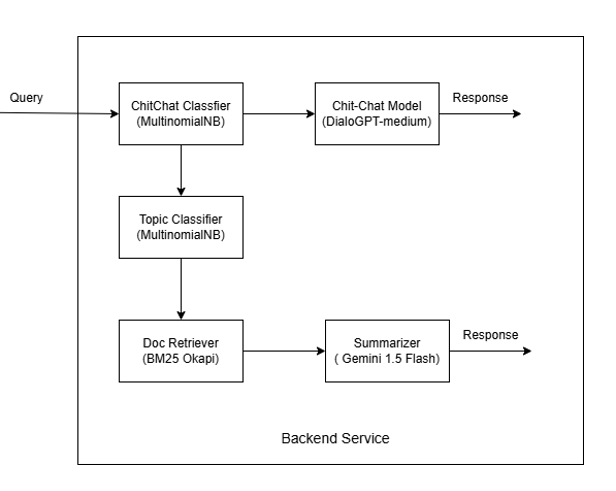

# **Wiki Chatbot**

Flowchart:

This project is built on Flask framework.

Following are the components used in the backend service:

1) **ChitChat Classifier:**
    For the chitchat classifier we create a pipeline of TfidfVectorizer and MultinominalNB model using sklearn library. We used [chit-chat dataset](https://github.com/BYU-PCCL/chitchat-dataset) with chitchat label and scraped wiki titles for wiki label as training dataset.
2) **Topic Classifier:**
    Created a pipeline of TfidfVectorizer and MultinominalNB. Trained using the 'summary' of wiki data.
3) **Document Retriever**
    Used Okapi BM25 algorithm ([rank_bm25 library](https://pypi.org/project/rank-bm25/)) for ranking the docs.
4) **Summarizer**
    We used 'Gemini-1.5 Flash' model using GCP vertex AI service.
